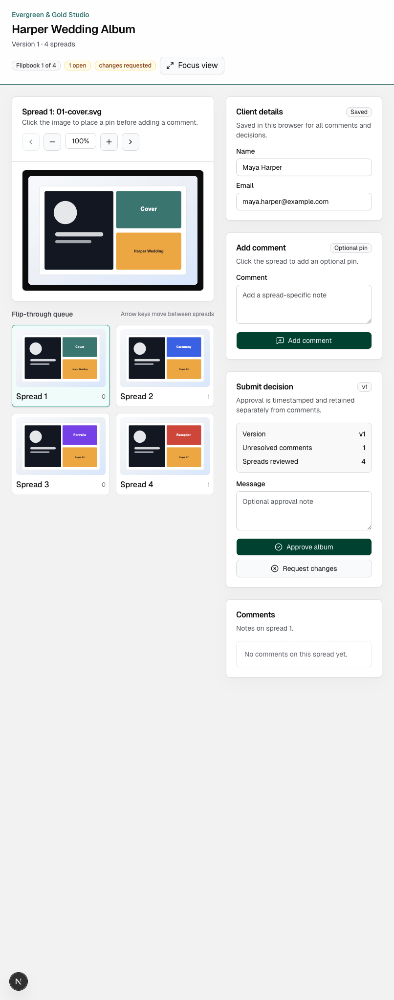

# Album Approve

Album Approve is a full-stack album proofing app for wedding and portrait photographers. Studios can upload exported album spreads, share a private flip-through proof with clients, collect pinned spread-level comments, manage revisions, export feedback, and record final approval before an album goes to print.

## TLDR

Album Approve replaces scattered album review threads with one visual approval workflow: upload spreads, send a private proof link, collect exact client comments, and capture the final decision. The current repository includes a polished product landing page, a seeded preview workflow, secure guest proof links, signed private asset delivery, Stripe/Resend/Supabase integration boundaries, automated tests, architecture docs, and a Cloudflare Workers deployment path.



## Demo

Live preview: [album-approve.hangi87.workers.dev](https://album-approve.hangi87.workers.dev)

The repository also includes a seeded local preview:

```bash
npm install
npm run seed
npm run dev
```

Open `http://localhost:3000`, sign in with `demo@proofalbum.test`, then open the Harper Wedding Album project and its demo proof link.

## About

Album Approve is built around a narrow studio workflow: proof wedding albums with clients before production. The app intentionally separates the client proofing surface from the studio dashboard, keeps guest access scoped to share links, and isolates database, storage, billing, and email integrations behind server modules.

Core user flows:

- Studio dashboard for projects, versions, uploads, proof links, billing state, CSV export, and comment resolution.
- Client proofing portal with signed links, optional password protection, responsive spread review, zoom, keyboard navigation, click-to-pin comments, and approval/change-request decisions.
- Seeded preview data and assets for repeatable local review and automated tests.

## Tech Stack

- **Framework:** Next.js 16 App Router, React 19, TypeScript.
- **UI:** Tailwind CSS, shadcn/ui-style primitives, Radix UI, lucide-react icons.
- **Validation:** Zod schemas for server actions and proofing forms.
- **Persistence:** Local JSON preview store under `.data`, with a Supabase Postgres migration and server-only Supabase admin boundary.
- **Storage:** Local private asset storage with signed asset URLs; production target is Supabase Storage or S3-compatible private object storage.
- **Payments:** Stripe Checkout and webhook integration with safe local fallbacks when Stripe env vars are missing.
- **Email:** Resend-ready email boundary with local notification logging when credentials are absent.
- **Testing:** Vitest coverage for proof-token scoping, comment/approval behavior, CSV export, and signed asset validation.

## Engineering Highlights

- **Secure share links:** Proof tokens are generated with cryptographic randomness and stored as HMAC hashes, so newly created tokens are only revealed once.
- **Private asset access:** Spreads are served through `/api/assets/[...key]` only when an expiring HMAC signature matches the storage key.
- **Separated studio and guest access:** Dashboard routes use a signed HTTP-only session cookie, while proofing access is scoped to share tokens and optional token-bound proof cookies.
- **Versioned approval model:** Comments and approvals attach to album versions, and approved versions receive immutable approval timestamps.
- **Upload validation:** JPG, PNG, and PDF imports validate MIME type, extension, size, storage key safety, and image dimensions before becoming proofable spreads.
- **External service boundaries:** Stripe, Resend, Supabase, and storage integration points are isolated behind server modules so the preview can run locally without production credentials.
- **Repeatable preview path:** `npm run seed` resets the local app to a known wedding album with spreads, comments, proof link, billing state, and email activity.

## Architecture

The app is a server-rendered Next.js application with client components for rich review interactions. Mutations flow through Server Actions, data access is centralized in `src/server/store.ts`, and asset access is mediated through signed route handlers.

- Architecture overview and C4-style container diagram: [docs/architecture.md](docs/architecture.md)
- Architecture decision records: [docs/adrs/README.md](docs/adrs/README.md)
- Deployment notes: [docs/deployment.md](docs/deployment.md)
- Security notes: [docs/security.md](docs/security.md)

## Project Structure

```text
src/app/                 Next.js routes, Server Actions, and API route handlers
src/components/          Proofing UI, dashboard UI, and shared primitives
src/server/              Auth, store, storage, billing, email, security, schemas
src/lib/                 Formatting and utility helpers
scripts/                 Preview seed script
supabase/migrations/     Initial Postgres schema and RLS starter policies
docs/                    Architecture, ADRs, deployment, and security notes
```

## Local Setup

```bash
npm install
cp .env.example .env.local
npm run seed
npm run dev
```

Open `http://localhost:3000`, sign in with `demo@proofalbum.test`, and open the sample proof link from the project page.

Useful commands:

```bash
npm run format
npm run lint
npm run typecheck
npm test
npm run build
```

## Environment Variables

See `.env.example`. The app runs locally without external credentials. Add Supabase, Stripe, and Resend values before using it with real client work.

Important variables:

- `NEXT_PUBLIC_APP_URL`
- `PROOFALBUM_SECRET`
- `NEXT_PUBLIC_SUPABASE_URL`
- `SUPABASE_SERVICE_ROLE_KEY`
- `STRIPE_SECRET_KEY`
- `STRIPE_WEBHOOK_SECRET`
- `RESEND_API_KEY`
- `EMAIL_FROM`

## Database And Storage

The initial Postgres schema is in `supabase/migrations/0001_initial_schema.sql`. It includes studios, studio members, clients, projects, album versions, spreads, share links, comments, approvals, and subscriptions, plus starter RLS policies.

Local preview uploads are written under `.data/uploads` and served only through signed asset URLs. JPG and PNG dimensions are extracted during upload. PDF imports are stored privately and converted into reviewable placeholder spreads per detected page. For production, replace local storage calls in `src/server/storage.ts` with Supabase Storage or S3-compatible private object storage and a real PDF page renderer.

## Stripe And Email

Set `STRIPE_SECRET_KEY`, `STRIPE_WEBHOOK_SECRET`, and the plan price IDs to enable real Stripe Checkout sessions and webhook subscription updates. When Stripe is not configured, checkout returns to the billing page in preview mode so the app remains usable.

Set `RESEND_API_KEY` and `EMAIL_FROM` to send proofing emails. Without credentials, email events are recorded in the local preview store so notification behavior remains visible.

## Deployment

The current live preview deploys to Cloudflare Workers with the OpenNext Cloudflare adapter. Cloudflare Pages is best suited to static Next.js exports; this app uses Server Actions and route handlers, so the hosted preview uses Cloudflare's full-stack Next.js Workers path.

```bash
npm run deploy:cf
```

The production target remains Supabase Postgres for relational data, private object storage for spreads, Stripe for subscriptions, and Resend for transactional email.

1. Create the Supabase project and run `supabase/migrations/0001_initial_schema.sql`.
2. Create a private storage bucket for album spreads.
3. Configure Stripe products and webhook URL `/api/stripe/webhook`.
4. Configure Resend sender/domain verification.
5. Set production env vars in Cloudflare.
6. Deploy with `npm run deploy:cf`.

More detail is in [docs/deployment.md](docs/deployment.md).

## Security And Privacy Notes

- Share tokens are random and stored as HMAC hashes.
- Proof link passwords are stored with scrypt hashes.
- Private storage keys are never exposed directly.
- Assets require expiring signatures.
- Dashboard access is separate from guest proofing access.
- Approval decisions store immutable timestamps and optional IP hashes.
- Production should add rate limits to guest password attempts, comments, and approval submissions.

More detail is in [docs/security.md](docs/security.md).

## Limitations And Future Work

- Replace the local JSON preview store with Supabase queries and generated database types.
- Move large uploads to direct-to-storage uploads instead of Server Action request bodies.
- Replace PDF placeholder previews with rendered page images.
- Add team members, studio roles, and richer usage gates.
- Add transactional email templates and webhook-driven subscription status sync.
- Add a production onboarding/request-access flow before charging real studios.
