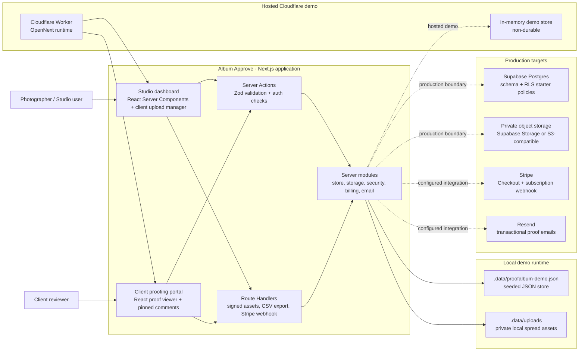

# Architecture

Album Approve is a Next.js App Router application that keeps the portfolio demo self-contained while preserving production boundaries for data, storage, billing, and email.

## Overview

The app has two main surfaces:

- **Studio dashboard:** authenticated routes for projects, clients, versions, spread upload management, proof link creation, comment resolution, CSV export, billing, and settings.
- **Client proofing portal:** token-scoped routes for album review, pinned spread comments, optional password unlock, and approval or change-request submission.

Server Actions handle most mutations. Route handlers cover signed asset delivery, Stripe checkout/webhooks, and CSV export. Shared server modules own validation, persistence, storage, security, billing, and email boundaries.

## Container Diagram

## Runtime Flow

### Studio Workflow

1. A studio user signs in through the local demo session flow.
2. Dashboard routes call `getCurrentUser()` before rendering protected project data.
3. Project, version, upload, link, comment-resolution, and archive mutations run through Server Actions in `src/app/actions/dashboard.ts`.
4. Server Actions validate form input with Zod schemas in `src/server/schema.ts`, then call store functions in `src/server/store.ts`.
5. Uploads are validated in `src/server/storage.ts`, written to private local storage, and represented as spreads on an album version.
6. Proof links generate random tokens, store HMAC token hashes, and reveal the raw token only in the creation redirect.

### Client Proofing Workflow

1. A reviewer opens `/proof/[token]`.
2. The server resolves the HMAC token hash and checks optional password or proof-access cookie state.
3. The proofing page receives signed URLs for each spread and renders the interactive `ProofViewer` client component.
4. Client comments submit through `addProofCommentAction`, which verifies token scope before appending comments to the version.
5. Approval or change-request decisions submit through `submitProofDecisionAction`, which records an append-only approval event and updates version status.

### Asset Access Flow

1. Spread URLs are generated with an expiring HMAC signature.
2. `/api/assets/[...key]` rejects missing, expired, or mismatched signatures.
3. Valid requests read the private local asset and return it with private cache headers.
4. Storage keys are normalized to reject path traversal before filesystem access.

## Deployment Shape

The current repository supports a local demo and a production target:

- **Local demo:** JSON persistence and local file storage under `.data`, with seeded demo assets and fake-safe Stripe and email behavior.
- **Hosted demo:** Cloudflare Workers with OpenNext, static asset binding, Node.js compatibility, and non-durable in-memory demo storage.
- **Production target:** Supabase Postgres for relational data, private object storage for spreads, Stripe for subscriptions, and Resend for transactional email.

`src/server/repository.ts` exposes a Supabase readiness check so production setup can fail early when the schema or credentials are missing.

## Key Constraints

- The local JSON store is intentionally simple and not a concurrent production database.
- Large uploads should eventually move to direct-to-storage uploads instead of passing through Server Action request bodies.
- PDF imports currently create placeholder review spreads from detected page counts; production should render actual PDF pages.
- The demo auth flow is not a production identity provider. Production should use Supabase Auth, Clerk, or an equivalent auth system and enforce studio membership on every mutation.
- Guest proofing actions need rate limits before production traffic.
